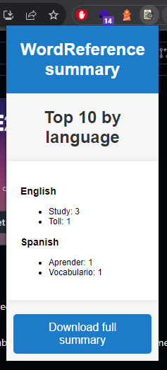

# WordReference summary

Have you ever wished to be able to save every word you search for on WordReference? Now it's possible with a simple Chrome extension that allows you to:

- 📚 Automatically save every word you look up
- 🔁 Translations from English to Spanish or vice versa
- 🔍 View the most searched words by language
- 💡 Review your vocabulary by downloading a JSON file with all the searched words.

[Download from Chrome web store](https://chrome.google.com/webstore/detail/wordreference-summary/bklpghgbkbdcaoebmdloeeebfppeoado) 

## Screenshot and example file


Example JSON file:
```json
{
   "wordsByLanguage":{
      "english":{
         "study":{
            "count":3
         },
         "toll":{
            "count":1
         }
      },
      "spanish":{
         "aprender":{
            "count":1
         },
         "vocabulario":{
            "count":1
         }
      }
   }
}
```

## How to add support for another language?
If you want to customize it to have more languages, you can do so by simply adding
a new JS file that will be triggered when the pattern matches the specification in `manifest.json`
Then in that script you have to get the word is being searched in the query params and create a 
new instance with the name of the language.
```javascript
let url = new URL(location.href)
let wordTranslated = url.searchParams.get("tranword")
let word = new Word(wordTranslated, "your new language")
word.updateCount()
```